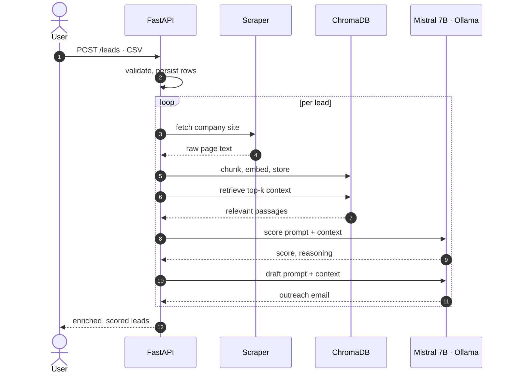
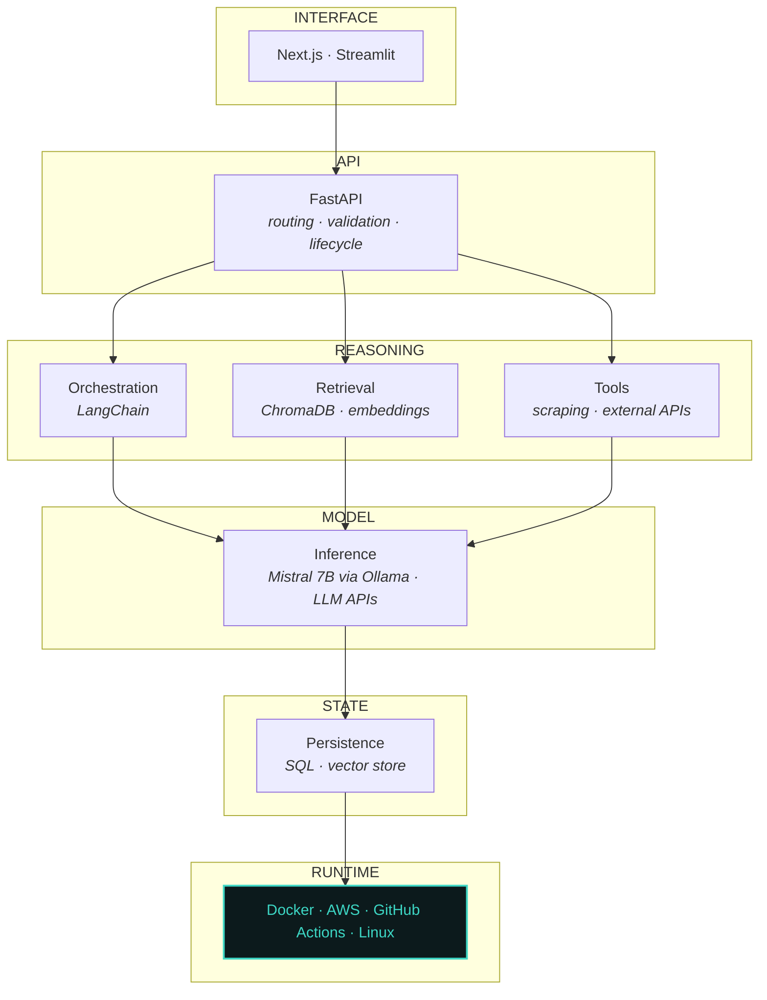

<div align="center">

<h1>Nikhat&nbsp;Shaikh</h1>

<h3>AI&nbsp;Engineer</h3>

<code>GENAI</code> &nbsp;<code>RETRIEVAL</code> &nbsp;<code>AUTOMATION</code> &nbsp;<code>BACKEND</code>

<br><br>

Building systems that connect language models to real data,<br>
real tools and the infrastructure they have to run on.

<br>

<a href="https://claude.ai/artifact/8PjAEzyezbuQJHoN3rfN3a"></a>
<a href="https://www.linkedin.com/in/nikhat-h-shaikh/"></a>
<a href="mailto:nikhat.sn.shaikh@gmail.com"></a>
<a href="https://github.com/buildwithnikhat?tab=repositories"></a>

<br><br>

<sub>
<a href="#what-i-build">WHAT I BUILD</a> &nbsp;·&nbsp;
<a href="#01--prospectiq">FLAGSHIP</a> &nbsp;·&nbsp;
<a href="#system-design">SYSTEM DESIGN</a> &nbsp;·&nbsp;
<a href="#supporting-work">WORK</a> &nbsp;·&nbsp;
<a href="#background">BACKGROUND</a> &nbsp;·&nbsp;
<a href="#contact">CONTACT</a>
</sub>

<br><br>

<sub>Pune, India &nbsp;·&nbsp; Previously DevOps &amp; cloud infrastructure</sub>

</div>

---

## What I build

Systems that take unstructured business data, put a language model somewhere useful in the path, and return something a person can act on. Retrieval pipelines, FastAPI services, local and hosted inference, and the container and cloud plumbing underneath.

> [!NOTE]
> I came to AI engineering from two years of AWS infrastructure and CI/CD work. That's the layer where most AI projects actually break, and it's the part I already know.

<table>
<tr><td width="160"><b>AI</b></td><td>RAG · retrieval pipelines · prompt design · LangChain · Ollama</td></tr>
<tr><td><b>Backend</b></td><td>Python · FastAPI · SQLAlchemy · Pydantic · SQL</td></tr>
<tr><td><b>Infrastructure</b></td><td>Docker · AWS · GitHub Actions · Linux · Git</td></tr>
<tr><td><b>Exploring</b></td><td>LangGraph · agents · pgvector · Celery · n8n</td></tr>
</table>

<sub>Listed by what my repositories demonstrate. The last row is what I'm learning, not what I'd claim in an interview.</sub>

---

# Flagship

## 01 — ProspectIQ

**Lead intelligence and outreach generation**

Sales teams sit on lists of company names with no context. ProspectIQ gathers public information about each company and returns a scored lead with a drafted outreach email grounded in what it found.

### Request lifecycle



<table>
<tr><td width="150"><b>Problem</b></td><td>Manual prospect research is slow, and generic outreach gets ignored.</td></tr>
<tr><td><b>Approach</b></td><td>Scrape public company context, embed it, retrieve relevant passages at generation time so the score and the email are grounded rather than invented.</td></tr>
<tr><td><b>Inference</b></td><td>Mistral 7B running locally through Ollama. Lead data never leaves the machine and there is no per-token cost.</td></tr>
<tr><td><b>Stack</b></td><td><code>FastAPI</code> <code>LangChain</code> <code>ChromaDB</code> <code>Ollama</code> <code>Streamlit</code> <code>Docker</code></td></tr>
</table>

<details>
<summary><b>Engineering notes</b> &nbsp;— why it is built this way</summary>

<br>

<details>
<summary><b>Local inference over a hosted API</b></summary>

<br>

Lead data is client data. Keeping inference local removes third-party exposure and running cost entirely.

The trade-off is real: a 7B model gives up quality against a frontier model, and throughput is bound by local hardware rather than scaling horizontally. For a product with paying users I would revisit this and route only non-sensitive fields to a hosted model.

</details>

<details>
<summary><b>ChromaDB over a managed vector store</b></summary>

<br>

It runs embedded, so there is no second service to operate at this size, and no network hop on every retrieval.

At larger scale I would move to PostgreSQL with pgvector and keep vectors alongside the relational data, which removes an entire class of sync problems between two stores.

</details>

<details>
<summary><b>Retrieval before generation</b></summary>

<br>

Scoring a lead from the model's own knowledge produces confident nonsense about companies it has never seen. Grounding each judgement in scraped text is what makes the output checkable by a human.

</details>

<details>
<summary><b>What it does not do yet</b></summary>

<br>

Single process with no job queue, so a large CSV blocks the request. Scraping is best effort and fails on JavaScript-rendered sites. There is no retry or backoff around the scraper.

Next: Celery for background processing, a retry layer, and structured logging so failures are visible rather than silent.

</details>

</details>

<p align="center">
<a href="https://github.com/buildwithnikhat/prospectiq-ai-sales-platform"></a>
</p>

---

## System design

How I lay out an AI application. The model is one layer.



> [!TIP]
> Everything above the model decides what reaches it. Everything below decides whether it stays up. Most of the engineering lives outside the box marked *inference*.

---

## Supporting work

<table>
<tr>
<td width="33%" valign="top">

**02**

### [AI Resume Intelligence](https://github.com/buildwithnikhat/ai-resume-intelligence)

Analyses a resume against a target role and returns specific revisions rather than generic advice.

<sub><code>FastAPI</code> <code>Next.js</code> <code>Ollama</code> <code>Docker</code></sub>

</td>
<td width="33%" valign="top">

**03**

### [Interview Simulator](https://github.com/buildwithnikhat/ai-powered-interview-simulator)

Conversational interview practice that asks follow-up questions based on the answer given.

<sub><code>FastAPI</code> <code>LLM APIs</code> <code>Python</code></sub>

</td>
<td width="33%" valign="top">

**04**

### [Marketing ROI Dashboard](https://github.com/buildwithnikhat/marketing-roi-dashboard)

Ingests campaign data, computes KPIs and reports spend against return.

<sub><code>FastAPI</code> <code>Streamlit</code> <code>SQL</code> <code>Pandas</code></sub>

</td>
</tr>
</table>

<sub><b>Experiments</b> · <a href="https://github.com/buildwithnikhat/spotify-ai-recommendation-system">Spotify recommendation system</a> — collaborative filtering, notebooks, container setup.</sub>

---

## Engineering principles

```
01   Ground the output. A model asked to judge something it has
     never seen will invent a confident answer.

02   Automate the workflow, not just the response. A good answer
     that still needs manual handling has not saved anyone time.

03   Design for the failure path. Scrapers break, models time out,
     rate limits arrive. Decide what happens then, up front.

04   Keep inference costs visible. Token spend is an architecture
     decision, not an invoice surprise.

05   Make it observable before making it clever. You cannot tune
     what you are not measuring.

06   Ship, then extend. An undeployed system has taught you
     nothing about how it behaves.
```

## Currently

```
●  Deploying an LLM service to AWS end to end
●  Moving retrieval from ChromaDB to PostgreSQL with pgvector
●  Background job processing with Celery
●  Reading into agent orchestration and LangGraph
```

## Background

<table>
<tr>
<td width="180" valign="top"><sub><b>JUN 2022 — MAY 2024</b></sub></td>
<td valign="top">

**DevOps Engineer** · Siril Technologies

AWS infrastructure and deployment workflows for client applications. CI/CD pipelines with GitHub Actions, containerised services with Docker, Linux server environments.

</td>
</tr>
<tr>
<td valign="top"><sub><b>2018 — 2022</b></sub></td>
<td valign="top">

**BE Computer Engineering** · Savitribai Phule Pune University

</td>
</tr>
</table>

---

<div align="center">

<h2>Contact</h2>

Open to AI engineering, GenAI and Python backend roles.<br>
Remote, or Pune on-site and hybrid. Freelance AI automation work considered.

<br>

<a href="mailto:nikhat.sn.shaikh@gmail.com"></a>
<a href="https://www.linkedin.com/in/nikhat-h-shaikh/"></a>

</div>
