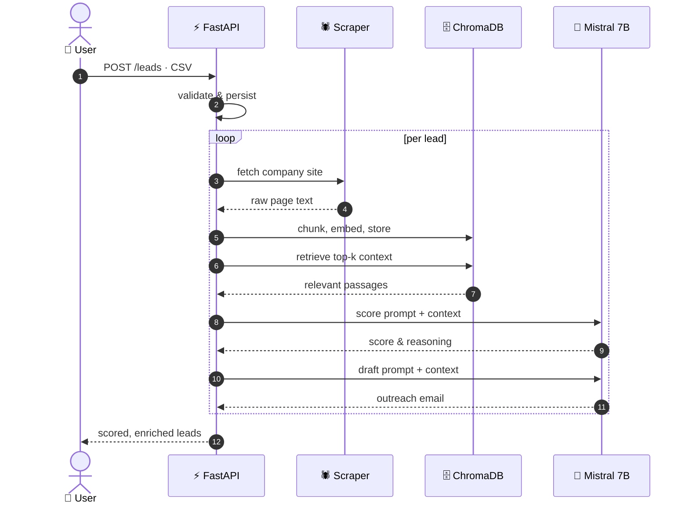
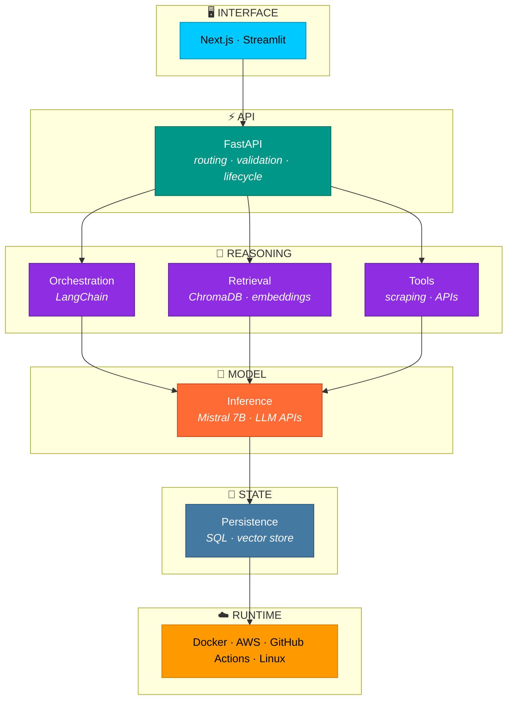

<div align="center">


<br>

<a href="https://claude.ai/artifact/8PjAEzyezbuQJHoN3rfN3a"></a>
<a href="https://www.linkedin.com/in/nikhat-h-shaikh/"></a>
<a href="mailto:nikhat.sn.shaikh@gmail.com"></a>
<a href="https://github.com/buildwithnikhat?tab=repositories"></a>

<br><br>


</div>


## 💡 What I build

I build AI systems that solve actual business problems, not demos. Retrieval pipelines that ground answers in real data, FastAPI backends that hold up under load, and the Docker and cloud plumbing that keeps it all running.

> [!NOTE]
> **My edge:** two years of hands-on AWS infrastructure and CI/CD experience before moving into AI. Most AI projects don't break at the model, they break at deployment, cost and reliability. That's the layer I know best.

<div align="center">

### 🛠️ Stack


</div>

<table>
<tr>
<td width="160"><b>🤖 AI</b></td>
<td>


</td>
</tr>
<tr>
<td><b>⚙️ Backend</b></td>
<td>


</td>
</tr>
<tr>
<td><b>☁️ Infrastructure</b></td>
<td>


</td>
</tr>
<tr>
<td><b>📚 Exploring</b></td>
<td>


</td>
</tr>
</table>

<sub>The last row is what I'm learning. I keep it separate on purpose.</sub>


## 🎯 Services

What I take on as a freelancer:

<table>
<tr>
<td width="50%" valign="top">

### 🔍 RAG & Search Systems
Chat over your documents, internal knowledge search, grounded Q&A. Embeddings, vector storage, retrieval tuning.

### 🤖 LLM Integrations
Bring a model into an existing product. Prompt design, structured output, cost control, fallback handling.

</td>
<td width="50%" valign="top">

### ⚡ AI Automation
Turn a manual workflow into a pipeline. Data in, model in the middle, action out.

### 🏗️ Python & FastAPI Backends
APIs, background jobs, database design, Dockerised and deployed.

</td>
</tr>
</table>

<div align="center">
<a href="mailto:nikhat.sn.shaikh@gmail.com"></a>
</div>


<div align="center">

# ⭐ Flagship Project

</div>

## 01 — ProspectIQ

**AI lead intelligence and outreach generation**

Sales teams sit on lists of company names with no context. ProspectIQ gathers public information on each company and returns a scored lead with a drafted outreach email grounded in what it found.



<table>
<tr><td width="140"><b>🎯 Problem</b></td><td>Manual prospect research is slow, and generic outreach gets ignored.</td></tr>
<tr><td><b>🧩 Approach</b></td><td>Scrape company context, embed it, retrieve relevant passages at generation time so the score and email are grounded rather than invented.</td></tr>
<tr><td><b>🔐 Inference</b></td><td>Mistral 7B running locally via Ollama. Lead data never leaves the machine, and there's no per-token cost.</td></tr>
<tr><td><b>⚙️ Stack</b></td><td>    </td></tr>
</table>

<details>
<summary><b>🔧 Engineering notes</b> &nbsp;— why it's built this way</summary>

<br>

<details>
<summary>🏠 <b>Local inference over a hosted API</b></summary>

<br>

Lead data is client data. Keeping inference local removes third-party exposure and running cost entirely.

The trade-off is real: a 7B model gives up quality against a frontier model, and throughput is bound by local hardware rather than scaling horizontally. For a product with paying users I'd revisit this and route only non-sensitive fields to a hosted model.

</details>

<details>
<summary>🗄️ <b>ChromaDB over a managed vector store</b></summary>

<br>

It runs embedded, so there's no second service to operate at this size and no network hop on every retrieval.

At larger scale I'd move to PostgreSQL with pgvector and keep vectors alongside the relational data, which removes a whole class of sync problems between two stores.

</details>

<details>
<summary>🎯 <b>Retrieval before generation</b></summary>

<br>

Scoring a lead from the model's own knowledge produces confident nonsense about companies it has never seen. Grounding each judgement in scraped text is what makes the output checkable by a human.

</details>

<details>
<summary>⚠️ <b>What it doesn't do yet</b></summary>

<br>

Single process with no job queue, so a large CSV blocks the request. Scraping is best effort and fails on JavaScript-rendered sites. No retry or backoff around the scraper.

Next: Celery for background processing, a retry layer, and structured logging so failures are visible rather than silent.

</details>

</details>

<div align="center">
<a href="https://github.com/buildwithnikhat/prospectiq-ai-sales-platform"></a>
</div>


## 🏗️ How I architect AI systems



> [!TIP]
> Everything above the model decides what reaches it. Everything below decides whether it stays up. Most of the engineering lives outside the box marked *inference*.


## 📦 More work

<table>
<tr>
<td width="33%" valign="top">

**02**

### [AI Resume Intelligence](https://github.com/buildwithnikhat/ai-resume-intelligence)

Analyses a resume against a target role and returns specific revisions, not generic advice.

  

</td>
<td width="33%" valign="top">

**03**

### [Interview Simulator](https://github.com/buildwithnikhat/ai-powered-interview-simulator)

Conversational interview practice that asks follow-ups based on the answer given.

  

</td>
<td width="33%" valign="top">

**04**

### [Marketing ROI Dashboard](https://github.com/buildwithnikhat/marketing-roi-dashboard)

Ingests campaign data, computes KPIs, reports spend against return.

  

</td>
</tr>
</table>

<sub>🧪 <b>Experiments</b> · <a href="https://github.com/buildwithnikhat/spotify-ai-recommendation-system">Spotify recommendation system</a> — collaborative filtering, notebooks, container setup.</sub>


## 🔨 Currently building

```
●  Deploying an LLM service to AWS end to end
●  Moving retrieval from ChromaDB to PostgreSQL with pgvector
●  Background job processing with Celery
●  Agent orchestration with LangGraph
```


<div align="center">

## 🚀 Let's build something

Open to **freelance AI projects**, **remote roles**, and **full-time AI engineering positions**.<br>
Pune on-site, hybrid, or fully remote.

<br>

<a href="mailto:nikhat.sn.shaikh@gmail.com"></a>
<a href="https://www.linkedin.com/in/nikhat-h-shaikh/"></a>
<a href="https://claude.ai/artifact/8PjAEzyezbuQJHoN3rfN3a"></a>

</div>


